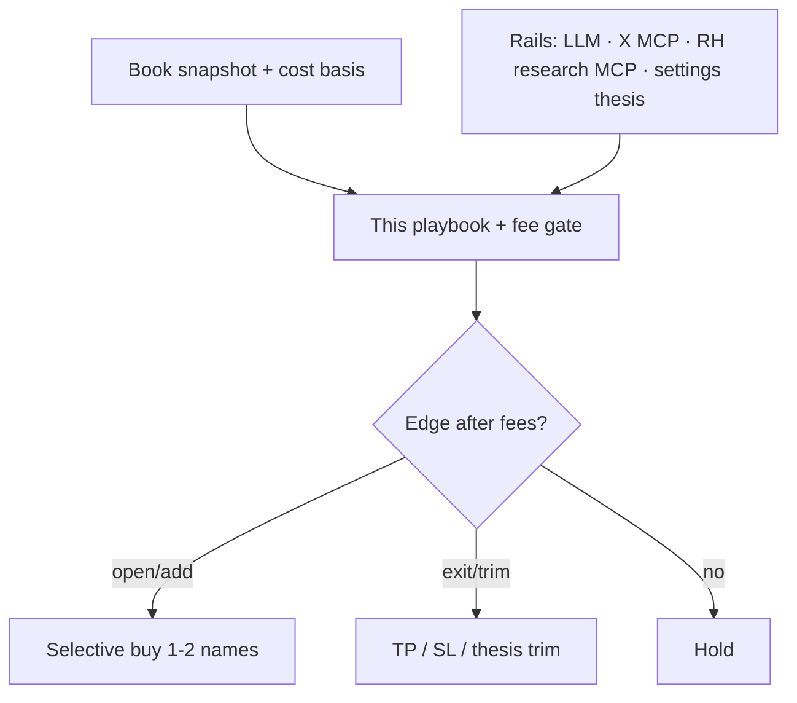

# Trading playbook — Stonk Trader Shell

**Audience:** local agents (autopilot, LLM, MCP) and operators.  
**Mandate:** keep a cash core at **`reserveWethPct` (default ~30% WETH/ETH)**; trade a **selective stock sleeve** for expected edge after fees.  
**Not financial advice.** Stock tokens are geo-restricted. Past patterns ≠ future results.

## What the allowlist is (and is not)

| Is | Is not |
| --- | --- |
| A **candidate universe** to consider each pass | A shopping list to buy every name |
| Filter for liquidity / mega-cap preference | Equal-weight target for every symbol |
| Input to thesis / LLM / research rails | A reason to micro-rebalance every interval |

**Default stance:** selective — open **1–2** names when thesis + fee gate clear.  
**Exception — excess cash:** if cash is **≥10pp above** `reserveWethPct` and the allowlist has **unheld** names, prefer **`risk_on` + one new open** (diversify the sleeve toward target). Do not park 90%+ cash because two small holdings look flat. Empty `preferBuys` then requires explicit **`risk_off`**.

## Decision stack (inputs → action)

1. **Book** — cash %, holdings, avg cost, unrealized P&L, deployable above reserve.  
2. **Rails** — LLM thesis + `preferBuys` / `preferSells`; optional X recent-search buzz (`useXSignals` + `X_BEARER_TOKEN`); optional Robinhood research MCP (quotes — **never** `place_*` for TBA).  
3. **Playbook rules** — `skills/*/SKILL.md` + cash core, position limits, TP/SL, fee EV gate.  
4. **Execute** — prepare/sign only if Dry run is OFF.

## Public references (best-practice anchors)

Use these as **principles**, adapted to a fee-heavy on-chain sleeve (not day-trading tick data).

### Asset allocation & risk (retail / regulator)

- [Investor.gov — Beginners’ Guide to Asset Allocation, Diversification, and Rebalancing](https://www.investor.gov/additional-resources/general-resources/publications-research/info-sheets/beginners-guide-asset)  
  - Separate **cash vs risk assets**; diversify *within* the risk sleeve; **rebalance** when allocation drifts — here that means restore cash to **`reserveWethPct`**, not force every allowlist name to equal weight.  
- [Investor.gov — Asset allocation & diversification](https://www.investor.gov/introduction-investing/getting-started/asset-allocation)  
  - Risk tolerance + time horizon drive mix; don’t concentrate the whole book in one name.  
- [Fidelity — Guide to diversification](https://www.fidelity.com/viewpoints/investing-ideas/guide-to-diversification)  
  - Practical concentration caution (e.g. avoid letting one stock dominate the *equity* sleeve); maintain the strategic mix with checkups.

### Risk constraints (professional framing)

- [CFA Institute — Measuring and Managing Market Risk](https://www.cfainstitute.org/insights/professional-learning/refresher-readings/2026/measuring-managing-market-risk)  
  - **Position limits**, **stop-loss limits**, and risk budgeting as portfolio constraints (not optional vibes).  
- [CFA Institute — IPS elements for individuals](https://rpc.cfainstitute.org/sites/default/files/-/media/documents/article/position-paper/investment-policy-statement-individual-investors.pdf)  
  - Document risk policy (our settings + this file = lightweight IPS).  
- [CFA Enterprising Investor — tight stops can hurt](https://rpc.cfainstitute.org/blogs/enterprising-investor/2026/why-tight-stop-losses-often-hurt-investors-and-what-robust-capital-growth-really-requires)  
  - Stops that are **too tight** chop winners; width should match noise. Our defaults (`stopLossPct` ≈ 2.5–5%, `takeProfitPct` ≈ 3+) are sleeve rules — widen if RH stock tokens are noisy relative to fees.

### Entries / exits (discretionary practice)

- [CIBC Investors Edge — Trade risk management: entries & exits](https://www.investorsedge.cibc.com/en/learn/investing/portfolio-strategies/trade-risk-management-part-2.html)  
  - Pre-define upside/downside; consider **scaling** in/out; don’t move targets on hope.  
- Trend-following consensus (industry practice, many primers): **cut losers**, **let winners run** (or trail), size so a single loss is a small % of equity, accept win rates often &lt;50%. Adapt with **fee gate** — on RH chain, tiny notionals are structurally negative EV.

## Rules this agent must follow

### Cash core (non-negotiable)

1. Target **`reserveWethPct` (default ~30%)** cash. If cash is below reserve − band → **sells only** (prefer winners) until restored.  
2. Never send TBA proceeds to the owner EOA. Buys spend **TBA** WETH/ETH; EOA pays **gas only**.

### Opens (buys)

3. Allowlist = **candidates**. Do **not** spray equal-weight buys across the list.  
4. Buy when thesis / LLM supplies **`preferBuys`** (≤2). Prefer **unheld** names when cash ≫ reserve (restore risk sleeve).  
5. Size from **deployable** cash above reserve, capped by `deployPct` and `maxNamePct` — one fee-viable ticket beats eight dust tickets.  
6. Adds to an existing name: prefer **dip vs avg cost** (`addOnlyDipBps`) unless thesis explicitly pyramids into strength.  
7. Skip if `notional < minNotionalUsd` or expected edge &lt; gas+slip (`minEdgeBps`). When cash is near target, prefer **hold** over forced churn.

### Exits (sells)

8. **Stop-loss** — **WETH-relative** unrealized P&L % ≤ −`stopLossPct` → **risk exit**. Clears fee gate when notional ≥ `minNotionalUsd` even if dollar uPnL is negative.  
9. **Take-profit** — **WETH-relative** unrealized P&L % ≥ `takeProfitPct` → **risk exit** trim (bank gains into cash).  
10. **Thesis sells** — `preferSells` / risk-off / X bearish buzz may trim mid-band (still need edge ≥ estimated sell fees unless the name has already breached TP/SL).  
11. Cash-restore sells may proceed with weak uPnL when cash is critically low (liquidity &gt; purity).  
11b. **Numeraire** — stock sleeve P&L is vs idle WETH (the pair you trade). USD NAV is for reporting; ETH/USD noise must not drive stops.

### Process hygiene

12. Max **`maxActionsPerPass`** — no spray.  
13. Dry run ON by default; Live feed must show thesis, preferBuys/Sells, fee pass/fail, X buzz when enabled.  
14. Combine rails: if LLM and settings disagree, **prefer hold** or the more conservative (smaller) action. X hints are soft — they fill empty slots, not override risk_off.  
15. Log reasons humans can audit (“why this name, why now”).

## Mapping settings → playbook

| Setting | Role |
| --- | --- |
| `reserveWethPct` | Cash / risk split (Investor.gov-style allocation) |
| `deployPct` | Max risk capital put to work **per pass** |
| `allowlist` | Candidate universe only |
| `minNotionalUsd` / `minEdgeBps` | Fee-aware EV floor |
| `takeProfitPct` / `stopLossPct` | Exit constraints (CFA-style stop / profit discipline) |
| `addOnlyDipBps` | Anti-chase on adds |
| `maxRiskPctPerTrade` | Risk budget on new opens (stop hit ≈ this % of book) |
| `maxNamePct` | Concentration limit |
| `maxActionsPerPass` | Heat / churn limit |
| `thesis` | Operator override notes (may name tickers) |
| `useXSignals` | When on + `X_BEARER_TOKEN`, recent cashtag buzz biases preferBuys/Sells |

## Anti-patterns (do not do)

- Equal-weight rebalance of every allowlist name every pass.  
- Buying “because cash is high” with no symbol thesis.  
- Sub-fee micro-trims that cannot clear gas+slip.  
- Averaging down endlessly without a stop.  
- Using Robinhood `place_*` for TBA execution.

## Disclaimer

Educational / systems documentation for a **local** agent. Not a recommendation to buy or sell any security or token. Crypto and geo-restricted stock tokens can lose principal; fees and slippage matter.
